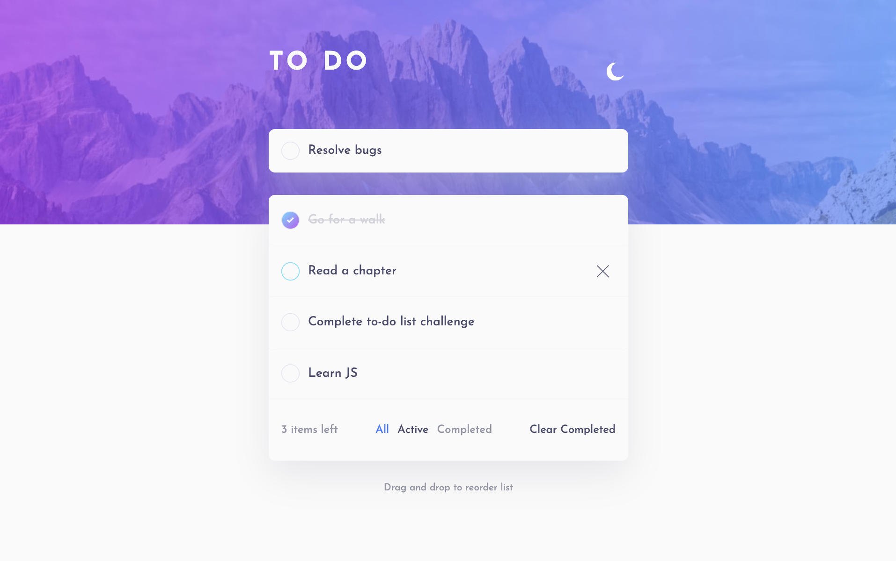

# Frontend Mentor - Todo app solution

This is a solution to the [Todo app challenge on Frontend Mentor](https://www.frontendmentor.io/challenges/todo-app-Su1_KokOW).

## Table of contents

- [Overview](#overview)
  - [The challenge](#the-challenge)
  - [Screenshot](#screenshot)
  - [Links](#links)
- [My process](#my-process)
  - [Built with](#built-with)
  - [What I learned](#what-i-learned)
  - [Continued development](#continued-development)
  - [Useful resources](#useful-resources)
- [Author](#author)

## Overview

### The challenge

Users should be able to:

- View the optimal layout for the app depending on their device's screen size
- See hover states for all interactive elements on the page
- Add new todos to the list
- Mark todos as complete
- Delete todos from the list
- Filter by all/active/complete todos
- Clear all completed todos
- Toggle light and dark mode
- Drag and drop to reorder items on the list

### Screenshot

<br />
Desktop - Light


Desktop - Dark


Desktop - Active - Light



Desktop - Active - Dark


Mobile - Light


Mobile - Dark


### Links

- [Solution URL](https://github.com/sree-lakshmi-n/frontend-mentor/tree/main/todo-app)
- [Live Site URL](https://to-do-list.sree112.repl.co)

## My process

### Built with

- Semantic HTML5 markup
- CSS custom properties
- Flexbox
- CSS Grid
- Mobile-first workflow
- [Sass](https://sass-lang.com/) - Sass Preprocessor

### What I learned

A small hack that enables the use of touch events on mobiles/ ipads using the jQuery UI user interface library.

```html
<script src="https://cdnjs.cloudflare.com/ajax/libs/jqueryui-touch-punch/0.2.3/jquery.ui.touch-punch.min.js"></script>
```

Adding elements to the beginning

```js
parent.prepend(todo);
```

Removing elements from document

```js
element.remove();
```

Drag and drop sorting functionality (Jquery)

```js
$(function () {
  $("#sortable").sortable({
    items: ".section-to-do__items",
  });
  $("#sortable").disableSelection();
});
```

### Continued development

- Preserve status on reload
- Build this project as a full-stack application

### Useful resources

- [Sortable Jquery](https://jqueryui.com/sortable) - Quick method to enable drag and drop sorting.
- [Touch Punch library](https://cdnjs.com/libraries/jqueryui-touch-punch) - A small hack that enables the use of touch events on mobiles/ ipads using the jQuery UI user interface library.
- [Touch Punch Github Page](https://github.com/furf/jquery-ui-touch-punch)

## Author

- Frontend Mentor - [@sree-lakshmi-n](https://www.frontendmentor.io/profile/sree-lakshmi-n)
